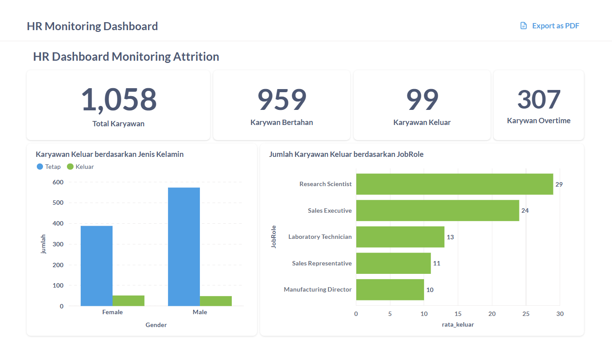

# Proyek Akhir: Menyelesaikan Permasalahan Perusahaan Jaya Jaya Maju

## Business Understanding

Jaya Jaya Maju merupakan salah satu perusahaan multinasional yang telah berdiri sejak tahun 2000. Ia memiliki lebih dari 1000 karyawan yang tersebar di seluruh penjuru negeri.

Walaupun telah menjadi menjadi perusahaan yang cukup besar, Jaya Jaya Maju masih cukup kesulitan dalam mengelola karyawan. Hal ini berimbas tingginya attrition rate (rasio jumlah karyawan yang keluar dengan total karyawan keseluruhan) hingga lebih dari 10%.

### Permasalahan Bisnis
Jaya Jaya Maju, tengah menghadapi tantangan serius dalam manajemen sumber daya manusia, yaitu tingginya tingkat attrition (keluar/mundurnya karyawan) yang telah mencapai lebih dari 10% dari total karyawan aktif.

Masalah ini memiliki urgensi tinggi karena:
- Tingginya biaya operasional: Setiap kali seorang karyawan mengundurkan diri, perusahaan harus mengalokasikan dana tambahan untuk proses perekrutan serta pelatihan bagi pengganti yang baru.
- Penurunan efisiensi kerja: Karyawan baru membutuhkan waktu untuk beradaptasi dan mencapai performa yang diharapkan, yang berpotensi menghambat produktivitas tim secara keseluruhan.
- Kehilangan aset pengetahuan internal: Pengalaman dan wawasan yang dimiliki karyawan lama sering kali sulit untuk ditransfer sepenuhnya kepada pengganti mereka.
- Dampak negatif terhadap motivasi tim: Tingkat pergantian karyawan yang tinggi dapat memicu ketidaknyamanan dan menurunkan semangat kerja rekan-rekan yang masih bertahan.
- Ancaman terhadap reputasi dan daya saing: Jika dibiarkan berlarut-larut, tingginya tingkat turnover bisa merusak citra perusahaan sebagai tempat kerja yang stabil dan menghambat kemampuan menarik serta mempertahankan talenta unggulan.

Permasalahan ini menunjukkan bahwa perusahaan membutuhkan pendekatan yang lebih strategis dan berbasis data dalam mengelola risiko attrition.

### Cakupan Proyek
Proyek ini bertujuan untuk menganalisis berbagai faktor yang berpotensi memengaruhi keputusan karyawan untuk meninggalkan perusahaan. Fokus utama akan diberikan pada dua aspek yang terbukti signifikan, yaitu tingkat frekuensi lembur dan jenis jabatan tertentu yang memiliki kecenderungan lebih tinggi terhadap tingkat attrition.

Selain itu, analisis juga akan mencakup elemen-elemen lain seperti keterlibatan karyawan dalam pekerjaan dan intensitas perjalanan dinas. Hasil dari analisis ini akan digunakan untuk mengidentifikasi kelompok karyawan yang memiliki risiko resign paling tinggi, serta memberikan wawasan mendalam tentang kondisi kerja yang dapat memicu keputusan untuk keluar.

Untuk mendukung pengambilan keputusan berbasis data, proyek ini akan dilengkapi dengan dashboard interaktif yang menyajikan hasil analisis secara visual dan real-time, sehingga memudahkan manajemen dalam merumuskan strategi retensi yang lebih efektif.


### Persiapan
| Jenis      | Keterangan                                                                 |
|------------|------------------------------------------------------------------------------|
| Title      | Jaya Jaya Maju                                                   |
| Source     | [github](https://github.com/dicodingacademy/dicoding_dataset/tree/main/employee) |
| Visibility | Public                                                                      |

Setup environment:

### 1. Buat Conda Environment

```bash
conda create -n employee-attrition-env python=3.10 -y
conda activate employee-attrition-env
```

### 2. Install Dependensi

```bash
pip install -r requirements.txt
```
Setup environment docker
### 1. Clone Repository

```bash
git clone https://github.com/MFakhrizalNA/DataScience-HR.git
cd DataScience-HR
```

### 2. Siapkan `docker-compose.yml`

Pastikan file `docker-compose.yaml` sesuai dengan struktur folder ini.

### 3. Jalankan Docker Compose

```bash
docker-compose up -d
```

### 4. Akses Metabase

Buka browser dan akses:

```
http://localhost:3000
```
Login Metabase menggunakan akun berikut:
| Email                                 | Password  |
| ------------------------------------- | --------- |
| [root@mail.com](mailto:root@mail.com) | root123 |
```

### 5. Hentikan Docker

```bash
docker-compose down
```

# Data Understanding
Dataset ini berisi informasi demografis dan metrik terkait pekerjaan dari karyawan, serta flag apakah karyawan tersebut melakukan attrition (keluar dari perusahaan).

| **Kolom**                  | **Deskripsi**                                                                 |
|---------------------------|-------------------------------------------------------------------------------|
| `EmployeeId`              | ID unik untuk masing-masing karyawan                                         |
| `Attrition`               | Apakah karyawan keluar? (0 = Tidak, 1 = Ya)                                   |
| `Age`                     | Usia karyawan                                                                 |
| `BusinessTravel`          | Frekuensi perjalanan dinas                                                    |
| `DailyRate`               | Gaji harian                                                                   |
| `Department`              | Departemen tempat bekerja                                                     |
| `DistanceFromHome`       | Jarak dari rumah ke tempat kerja (dalam km)                                   |
| `Education`               | Pendidikan terakhir (1=Below College, 2=College, 3=Bachelor, 4=Master, 5=Doctor) |
| `EducationField`         | Bidang studi atau pendidikan                                                   |
| `EnvironmentSatisfaction`| Kepuasan terhadap lingkungan kerja (1=Low, 2=Medium, 3=High, 4=Very High)      |
| `Gender`                  | Jenis kelamin karyawan                                                        |
| `HourlyRate`              | Gaji per jam                                                                  |
| `JobInvolvement`          | Tingkat keterlibatan kerja (1=Low, 2=Medium, 3=High, 4=Very High)             |
| `JobLevel`                | Tingkat posisi pekerjaan (1–5)                                                |
| `JobRole`                 | Jabatan atau peran dalam perusahaan                                           |
| `JobSatisfaction`         | Kepuasan terhadap pekerjaan (1=Low, 2=Medium, 3=High, 4=Very High)            |
| `MaritalStatus`           | Status pernikahan                                                             |
| `MonthlyIncome`           | Gaji bulanan                                                                  |
| `MonthlyRate`             | Penghasilan per bulan                                                         |
| `NumCompaniesWorked`      | Jumlah perusahaan yang pernah menjadi tempat kerja                            |
| `Over18`                  | Apakah usia di atas 18 tahun?                                                 |
| `OverTime`                | Apakah sering bekerja lembur?                                                 |
| `PercentSalaryHike`       | Persentase kenaikan gaji tahun lalu                                           |
| `PerformanceRating`       | Penilaian kinerja (1=Low, 2=Good, 3=Excellent, 4=Outstanding)                 |
| `RelationshipSatisfaction`| Kepuasan terhadap hubungan kerja (1=Low, 2=Medium, 3=High, 4=Very High)       |
| `StandardHours`           | Jam kerja standar                                                             |
| `StockOptionLevel`        | Tingkat opsi saham yang dimiliki                                              |
| `TotalWorkingYears`       | Total tahun pengalaman kerja                                                  |
| `TrainingTimesLastYear`   | Jumlah pelatihan yang diikuti tahun lalu                                      |
| `WorkLifeBalance`         | Keseimbangan kerja-hidup (1=Low, 2=Good, 3=Excellent, 4=Outstanding)          |
| `YearsAtCompany`          | Lama bekerja di perusahaan saat ini                                           |
| `YearsInCurrentRole`      | Lama berada di posisi saat ini                                                |
| `YearsSinceLastPromotion` | Lama sejak promosi terakhir                                                   |
| `YearsWithCurrManager`    | Lama bekerja dengan manajer saat ini                                          |

# Data Preparation
## 1. Mengatasi Missing Value
Data yang tidak lengkap atau hilang dalam suatu dataset bisa memengaruhi akurasi model atau bahkan menyebabkan kegagalan saat pelatihan. Oleh karena itu, penting untuk membersihkan data dengan cara menghapus atau mengisi nilai yang kosong guna menjaga kualitas dan konsistensi dataset yang akan digunakan.

## 2. Mengatasi Outliers
Nilai pencilan adalah data yang menyimpang jauh dari pola umum. Keberadaan outlier dapat memengaruhi performa model, terutama untuk algoritma yang sensitif terhadap distribusi data. Dengan menangani outlier, kita bisa menjaga keakuratan statistik dan hasil model, serta meningkatkan stabilitas dalam pelatihan.

## 3. Seleksi Fitur (Feature Selection)
Proses ini bertujuan untuk memilih fitur-fitur yang paling berpengaruh terhadap variabel target. Fitur yang terlalu banyak dan tidak relevan dapat menyebabkan model terlalu kompleks dan rentan terhadap overfitting. Dengan memilih fitur yang tepat, pelatihan menjadi lebih efisien dan hasil model lebih dapat diandalkan.

## 4. Splitting Data
Membagi data ke dalam set pelatihan dan pengujian merupakan langkah penting untuk mengevaluasi kinerja model secara objektif. Hal ini memungkinkan pengujian model dilakukan pada data yang belum pernah dilihat sebelumnya, sehingga hasil evaluasi lebih mencerminkan kemampuan model dalam menggeneralisasi.

## 5. Standarisasi
Proses ini bertujuan untuk menyeragamkan skala fitur numerik agar berada pada rentang yang sebanding. Beberapa algoritma seperti SVM, KNN, dan PCA sangat bergantung pada keseragaman skala untuk berfungsi secara optimal. Dengan standarisasi, konvergensi model menjadi lebih cepat dan hasil prediksi lebih akurat.

# Model Development
## Model Random Forest Classifier
**Random Forest** adalah ametode pembelajaran ensemble yang berbasis pada struktur decision tree. Teknik ini bekerja dengan menggabungkan hasil prediksi dari sejumlah pohon keputusan untuk meningkatkan akurasi serta stabilitas model. Setiap pohon dalam Random Forest dibangun dari sampel data dan fitur yang dipilih secara acak, menjadikan model ini lebih tahan terhadap overfitting dan efektif untuk data berdimensi tinggi.

Karakteristik utama Random Forest:
- Mengimplementasikan teknik bagging (bootstrap aggregating) untuk menghasilkan pohon-pohon yang bervariasi.
- Mengombinasikan prediksi dari seluruh pohon, biasanya dengan mekanisme voting pada kasus klasifikasi.
- Mampu menangani data yang memiliki missing value dan tidak terlalu terstandarisasi tanpa kehilangan performa secara signifikan.
- Lebih andal dan stabil dibandingkan decision tree tunggal, terutama dalam hal menghindari overfitting.


# Evaluation
## Clasification Report
**Classification Report** adalah ringkasan metrik evaluasi untuk model klasifikasi. Laporan ini memberikan wawasan tentang kinerja model dengan membandingkan label yang diprediksi terhadap label sebenarnya.
Classification Report biasanya mencakup metrik berikut untuk setiap kelas:

| **Metrik**  | **Deskripsi**                                                                                   |
|-------------|--------------------------------------------------------------------------------------------------|
| **Precision** | Proporsi prediksi positif yang benar-benar benar (True Positive / (True Positive + False Positive)) |
| **Recall**    | Proporsi data positif yang berhasil diprediksi dengan benar (True Positive / (True Positive + False Negative)) |
| **F1-score**  | Rata-rata harmonis dari precision dan recall, berguna saat ingin seimbangkan keduanya          |
| **Support**   | Jumlah kemunculan aktual dari masing-masing kelas dalam data                                   |

**Hasil Classification Report Model Random Forest Classifier** pada model ini adalah sebagai berikut:

Classification Report:
                        precision    recall  f1-score   support

                0.0       0.85      0.95      0.90         176
                1.0       0.40      0.17      0.24         36

            accuracy                          0.82         212
        macro avg         0.62      0.56      0.57         212
        weighted avg      0.77      0.82      0.78         212

## Business Dashboard



Untuk mempermudah pemantauan dan analisis risiko attrition secara berkala, telah dibuat sebuah dashboard interaktif menggunakan Metabase. Dashboard ini menyajikan visualisasi data yang intuitif dan informatif mengenai faktor-faktor yang mempengaruhi attrition, seperti:

- Distribusi attrition berdasarkan jabatan (Job Role), Gender dan frekuensi lembur (Overtime).
- Top 5 Karyawan berpotensi keluar sesuai JobRole berdasarkan Attrition_Predicted. 
- Segmentasi karyawan berdasarkan tingkat risiko attrition.

Alternatif lain untuk dashboard project ini ada dalam looker studio: [Dashboard HR Management](https://lookerstudio.google.com/reporting/cc791618-bf2f-458a-9d21-33ffa6c25cf0)


## Conclusion
Hasil analisis menunjukkan bahwa lembur yang berlebihan (overtime) dan jenis pekerjaan tertentu (job role) memiliki pengaruh besar terhadap keputusan karyawan untuk keluar dari perusahaan. Karyawan dengan posisi seperti Sales Executive, Research Scientist, dan Laboratory Technician cenderung memiliki beban kerja yang tinggi dan lebih sering lembur, sehingga mereka lebih berisiko mengalami kelelahan dan akhirnya resign. Oleh karena itu, pengelolaan beban kerja dan perhatian khusus pada jabatan-jabatan tersebut menjadi kunci penting dalam upaya menekan tingkat attrition.


### Rekomendasi Action Items (Optional)
 Beberapa rekomendasi item yang bisa diterapkan oleh perusahaan Jaya Jaya Maju:
 1. Sebanyak 307 karyawan yang sering resign adalah overtime, maka dari itu perusahaan bisa melakukan evaluasi beban kerja dan distribusi jam lembur
 2. Potensi prediksi attrition dibagian JobRole tertinggi adalah Sales Executive, Research Scientist, dan Laboratory Technician, bisa  diakukan survei kepuasan kerja internal atau evaluasi kepemiminan di depatremen tersebut.
